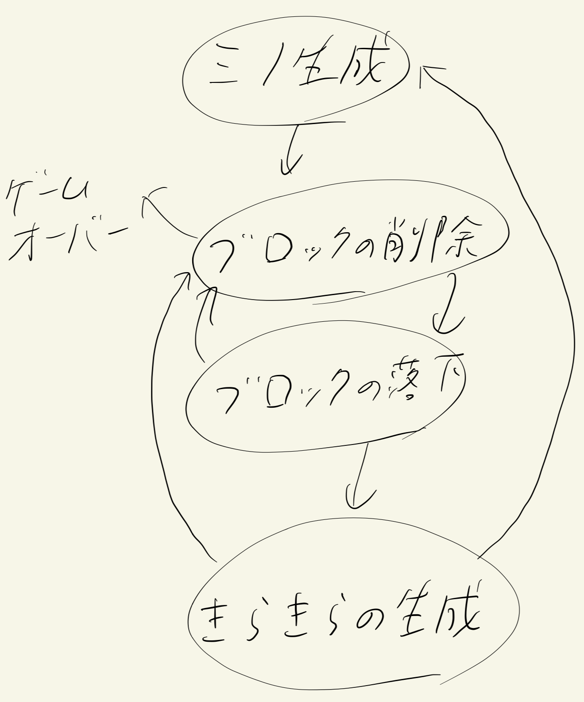

# 提出作品「カービィのきらきらきっずのアレンジ」の説明
### 北川 太一

## はじめに
&emsp;今回、自分はこの作品はVisual Studio2022でオープンソースのフレームワーク[Siv3D](https://siv3d.github.io/)を用いてアプリ開発を行った。

### 全体の概要
&emsp;シーンマネージャーを用いて、このゲームでは4つのシーンを遷移するようにしている。タイトルシーンとチュートリアルシーン(ゲームの説明画面)、実際にプレイできるゲームシーン、結果や過去のランキングを表示するエンディングシーンの4つである。 
&emsp;今回はこの中でもゲームシーンとエンディングシーンの説明を行うこととする。

#### ゲームシーンのフェーズ遷移
 

&emsp;今回自分が作ったプログラムでは、「カービィのきらきらきっず」は以下のようなフェーズ遷移で構成できると考えた。
 
&emsp;これを元に今回は名前空間で複数のオブジェクト間で、フラグの切り替えをできる上に感知できるような仕様を作った。 
&emsp;また、上の図をもっと大まかにみるとフェーズは「**ミノの生成フェーズ**」と「**ブロックの削除・落下・きらきらの生成フェーズ**」と大きく2つに分断できることもわかる。前者は「**minoフェーズ**」、後者は「**arrangeフェーズ**」と分けている。今回はそれぞれのフェーズに対応するクラスを作った。「**minoフェーズ**」は**MinoAdminクラス**が担当し、「**arrangeフェーズ**」は**Boardクラス**が担当するとしている。 
&emsp;また、このゲームシーンの処理をすべて担当する**Gameクラス**のメンバ関数update()を見ればわかる通り、処理はやはり全てBoardオブジェクトとMinoAdminオブジェクトが担当していることがわかる。このようにして読みやすいようなコードを目指した。 
&emsp;そして今回、乱数の生成器として、メルセンヌ・ツイスターを利用できるグローバル関数をinfo.hで宣言し、info.cppで定義を行っている。これはBoardクラスにもMinoクラスにも用いられている。より不規則な乱数が生成されるように
&emsp;以下では、それぞれ**minoフェーズ**・**arrangeフェーズ**を主軸に説明を行う。

 

##### minoフェーズについて
&emsp;MinoAdminクラスは落下中のブロック、次に降ってくるブロック、ホールドのブロックと全部をMinoというクラスのオブジェクトに変換するようにしました。Minoクラスにコピーコンストラクタを設定してブロックの交換の簡略化を行うことが目的でした。 
&emsp;MinoAdminクラスの実装で一番手間取ったのは、ミノを回転させることができるかなどの判定でした。このソースコードでは、現在の盤面のデータを持っているのはBoardオブジェクトなのでデータを持ってくるわけにもいかず、手間取りました。 
&emsp;最終的には、MinoAdminクラスのsync()メンバ関数が呼ばれたら現在落下中のブロックの座標と向きを名前空間に渡してそれをBoardクラスが受け取り、Board::judgeMino()関数が置けるか判定を行い、置けなかったらMinoAdminオブジェクトに返し動かさないように指示を出させた。

##### arrangeフェーズについて
&emsp;まず、メンバ変数として盤面を保存するmap変数について。これには各マスにフラグを置いておき、更に画像データ型を返すメンバ関数もそれぞれもつようになっている。
&emsp;Boardクラスのメンバ関数の呼び出されるタイミングはほとんどarrange()メンバ関数が管理を行うようにしており、それもほとんどinfo.h内の名前空間process::flag内のフラグでタイミングを管理している。それに加えて今回のコードでは消えるブロックを点滅させるためだったり、ブロックが落下してもすぐ次のフェーズに行かないようにするために一定時間たったらフラグを立てるように工夫を行っている。 
&emsp;また、以下でboardメンバ関数の簡単な説明を行う。 
&emsp;最初にBoard::erase()関数の説明をする。この関数内ではUnionFindを用いて処理速度の増加を図る工夫を行っている。そしてここでブロックが消えるとき、爆弾ブロックが消されたときに点滅や爆発のフラグを立てるなどの処理も行っている。 
&emsp;次にBoard::drop()関数の説明を行う。ここでは1マスずつしっかり落ちて行っているようにしっかり演出を施している。これはBoard::explosion()関数も同様に1マスずつ消えるように設定を施している。 
&emsp;また、**arrangeフェーズ**と**minoフェーズ**の遷移の際にはinfo.hファイル内で宣言されてinfo.cppで定義された関数arrangeflag()関数またはminoflag()関数を呼ぶことで簡単に切り替えることができるようにしている。
 

#### Endingシーン
&emsp;このシーンでは呼ばれた際に毎回CSVファイルからデータを読み込み、書き込むときにソートを行ってから書き込むようにしている。